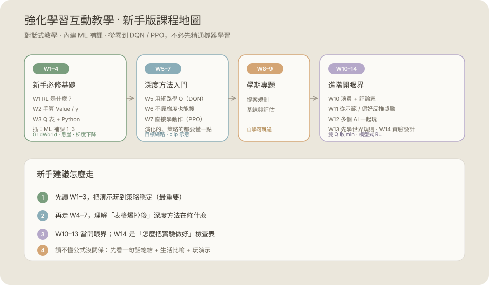

# 強化學習互動教學 · 新手版

一份**給完全沒學過強化學習（RL）的人**讀的互動教材。

- 對話式講解：先想一想 → 打開答案 → 程式 →「更深一點」
- 每課可動手玩的 Canvas 演示
- **內建 ML 補課**：沒學過機器學習也能一路讀到 DQN / PPO

[](lessons/)
[](lessons/)
[]()
[]()

## 本地開啟

```bash
cd rl-interactive-tutorial
python3 -m http.server 8080
# 瀏覽器打開 http://localhost:8080
```

也可以直接打開 `index.html`；若瀏覽器限制本機檔案，請用上面的伺服器方式。

<p align="center">
  
</p>

---

## 要先會機器學習嗎？

| 階段 | 需要 ML 嗎？ |
|------|----------------|
| 第 1–3 週（概念、Q 表、手算） | **不必** |
| ML 補課 1–3（教材內附） | 建議在第 4 週前讀完（約 1–2 小時） |
| 第 4 週起（函數近似） | 用到特徵加權（像線性模型） |
| 第 5 週起（DQN / PPO / SAC） | **需要** loss、梯度、神經網路直覺 |

**一句話：** 入門 RL 不必先會 ML；教材已把深度方法要用的 ML 拆成三課補進來。

---

## 建議學習路徑

```text
第 1 週  RL 是什麼？（對話式 + 程式）
   ↓
第 2 週  手算 Return / Value / γ + GridWorld 演示
   ↓
第 3 週  Q 表從零更新 + SARSA vs Q-learning + Python
   ↓
ML 補課 1–3   ML 是什麼 → 梯度下降 → 神經網路
   ↓
第 4–5 週  函數近似 → DQN（目標網路 / replay）
   ↓
第 6–7、10 週  無梯度搜尋 → REINFORCE / PPO → Actor-Critic
   ↓
第 11–13 週  開眼界：IRL / RLHF、多智能體、模型式 RL
   ↓
第 14 週  實驗設計（專題 / 看論文用）
```

第 8–9、15–18 週是課堂專題里程碑，自學可略過。

---

## 課程一覽

### RL 主線

| 週次 | 主題 | 互動 / 重點 |
|------|------|-------------|
| 1 | RL 是什麼？要先會 ML 嗎？ | 對話式 + 程式 |
| 2 | 手算 Return 與 Value | **GridWorld DP** |
| 3 | Q 表從零學會 | **懸崖世界 + Q-learning Python** |
| 4 | 狀態太多記不住 | **Tile coding TD** |
| 5 | DQN 與 Rainbow | **目標網路示範 + PyTorch 骨架** |
| 6 | 無梯度策略搜尋 | ES 最小程式 |
| 7 | REINFORCE 與 PPO | **PPO clip 示意 + REINFORCE 骨架** |
| 8–9 | 學期專題提案 | 規劃（自學可跳） |
| 10 | Actor-Critic（DDPG / TD3 / SAC） | **雙 Q 取 min + 概念碼** |
| 11 | 逆強化學習與 RLHF | 偏好損失直覺 |
| 12 | 多智能體（MADDPG / MAML） | CTDE 概念碼 |
| 13 | 模型式 RL（Dreamer） | 世界模型 I/O |
| 14 | 實驗設計 | 多種子模板 |
| 15–18 | 專題報告與寫作 | — |

### ML 補課（內建）

| 課次 | 內容 | 你會得到 |
|------|------|----------|
| ML 1 | 機器學習是什麼 | 監督式 vs RL、特徵/標籤/loss、手寫線性模型 |
| ML 2 | 損失與梯度下降 | θ ← θ − α∇L、學習率踩雷、接到 DQN loss |
| ML 3 | 神經網路直覺 | 前向/反向、最小網路、PyTorch DQN 零件表 |

---

## 每一課怎麼讀

1. 看 **「一句話總結」**
2. **點選「先想一想 / 小挑戰」按鈕**——立刻回饋對錯，再展開完整說明
3. 手算例子與概念鏈
4. **Python / 程式對照**
5. 玩互動演示（課文有「你可以這樣玩」）
6. 有餘力再看 **「更深一點」**

---

## 想寫程式

```bash
pip install gymnasium numpy
# 第 5 週之後：
pip install torch
```

推薦練習：

1. 跑第 3 週課文裡的最小 Q-learning
2. 換成 Gymnasium `CliffWalking-v0`
3. ML 補課 2–3 的梯度下降 / 最小網路
4. 第 5 週 DQN 骨架接到 `CartPole-v1`

---

## 技術

- 純 HTML / CSS / JS，不需建置
- Canvas 演示在 `js/`
- 可離線使用，適合 GitHub Pages
- 進度存在瀏覽器 `localStorage`
- 視覺：柔和紙本 / 鼠尾草綠主題（新手友善）

---

## 授權

自由使用於學習與教學。
